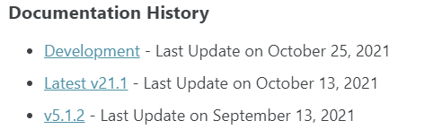
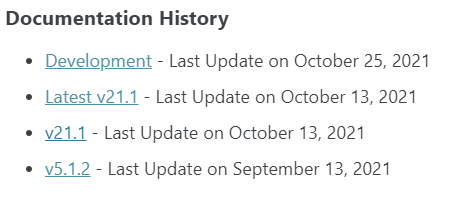

# Flows for APEX website

The site is publish on [Github Pages](https://pages.github.com/) and powered by [Jekyll](https://jekyllrb.com/) and the [Minimal Mistakes](https://mmistakes.github.io/minimal-mistakes/) theme.

## How to run the site locally

Clone the repository and follow this [guide](https://docs.github.com/en/pages/setting-up-a-github-pages-site-with-jekyll/testing-your-github-pages-site-locally-with-jekyll).

## How to create a new documentation version

When we release a new version of Flows for APEX we have to publish the development version as the latest and the previous latest under the version number.
For example, if we release 21.2, then:

- the actual latest version should be published under 21.1
- the actual development version should be published under latest
- the new development version should be keep as it

### Publish the previous latest under its version number

1. Rename the _latest folder to the version number eg. _21.1
2. In the config.yml file under the `collections` section copy the collection "latest", rename the copy with the version number (v21.1) and the attribute display_name with the version number (v21.1)

After

```yaml
collections:
  development:
    output: true
    permalink: /:collection/:path/
    type: "documentation"
    display_name: "Development"
    publish_date: 2021-10-25T00:00:00+00:00
    home_page: getting-started/
  latest:
    output: true
    permalink: /:collection/:path/
    type: "documentation"
    display_name: "Latest v21.1"
    publish_date: 2021-10-13T00:00:00+00:00
    home_page: getting-started/
  v5.1.2:
    output: true
    permalink: /:collection/:path/
    type: "documentation"
    display_name: "v5.1.2"
    publish_date: 2021-09-13T00:00:00+00:00
    home_page: tutorials/
```

Before

```yaml
collections:
  development:
    output: true
    permalink: /:collection/:path/
    type: "documentation"
    display_name: "Development"
    publish_date: 2021-10-25T00:00:00+00:00
    home_page: getting-started/
  latest:
    output: true
    permalink: /:collection/:path/
    type: "documentation"
    display_name: "Latest 21.1"
    publish_date: 2021-10-13T00:00:00+00:00
    home_page: getting-started/
  v21.1:
    output: true
    permalink: /:collection/:path/
    type: "documentation"
    display_name: "v21.1"
    publish_date: 2021-10-13T00:00:00+00:00
    home_page: getting-started/ 
  v5.1.2:
    output: true
    permalink: /:collection/:path/
    type: "documentation"
    display_name: "v5.1.2"
    publish_date: 2021-09-13T00:00:00+00:00
    home_page: tutorials/
```

3. In the config.yml file under the `defaults` section copy the scope "latest", rename the copy with the version number (v21.1)

Before

```yml
defaults:
  # _development
  - scope:
      type: development
    values:
      classes: wide
      layout: single
      read_time: false
      author_profile: false
      share: false
      comments: false
      sidebar:
        nav: "development"
  # _latest
  - scope:
      type: latest
    values:
      classes: wide
      layout: single
      read_time: false
      author_profile: false
      share: false
      comments: false
      sidebar:
        nav: "latest"
  # _v5.1.2
  - scope:
      type: v5.1.2
    values:
      classes: wide
      layout: single
      read_time: false
      author_profile: false
      share: false
      comments: false
      sidebar:
        nav: "v5.1.2"
```

After

```yml
defaults:
  # _development
  - scope:
      type: development
    values:
      classes: wide
      layout: single
      read_time: false
      author_profile: false
      share: false
      comments: false
      sidebar:
        nav: "development"
  # _latest
  - scope:
      type: latest
    values:
      classes: wide
      layout: single
      read_time: false
      author_profile: false
      share: false
      comments: false
      sidebar:
        nav: "latest"
  # _21.1
  - scope:
      type: v21.1
    values:
      classes: wide
      layout: single
      read_time: false
      author_profile: false
      share: false
      comments: false
      sidebar:
        nav: "21.1"
  # _v5.1.2
  - scope:
      type: v5.1.2
    values:
      classes: wide
      layout: single
      read_time: false
      author_profile: false
      share: false
      comments: false
      sidebar:
        nav: "v5.1.2"
```

4. In the _data/navigation.yml copy the latest documentation links and rename it to the version number.

Before

```yml
# latest documentation links
latest:
  - title: Getting started
    url: /latest/getting-started/
    children:
      - title: Tutorials
        url: /latest/tutorials/
  - title: Installation
    url: /latest/installation/
    children:
      - title: "Migration"
        url: /latest/migration/
      - title: "Deinstallation"
        url: /latest/deinstallation/
  ...
```

After

```yml
# latest documentation links
latest:
  - title: Getting started
    url: /latest/getting-started/
    children:
      - title: Tutorials
        url: /latest/tutorials/
  - title: Installation
    url: /latest/installation/
    children:
      - title: "Migration"
        url: /latest/migration/
      - title: "Deinstallation"
        url: /latest/deinstallation/
  ...
# 21.1 documentation links
v21.1:
  - title: Getting started
    url: /latest/getting-started/
    children:
      - title: Tutorials
        url: /latest/tutorials/
  - title: Installation
    url: /latest/installation/
    children:
      - title: "Migration"
        url: /latest/migration/
      - title: "Deinstallation"
        url: /latest/deinstallation/
  ...
```

The version should be publish under it's own url, take a look at the /documentation/ page to see if it's bublish. If you click on the new 21.1 link, you should be redirect to this version of the documentation.

Before



After



### Publish the current development under latest

1. Delete the _latest folder (make sure you have follow the previous step before)
2. Copy the _development, paste it and rename it _latest
3. In the config.yml file under the `collections` section for the collection "latest":
   - rename the attribute display_name with the correct version number
   - update the publish_date

Before

```yaml
latest:
    output: true
    permalink: /:collection/:path/
    type: "documentation"
    display_name: "Latest v21.1"
    publish_date: 2021-10-13T00:00:00+00:00
    home_page: getting-started/
```

After

```yaml
latest:
    output: true
    permalink: /:collection/:path/
    type: "documentation"
    display_name: "Latest v21.2"
    publish_date: 2021-10-20T00:00:00+00:00
    home_page: getting-started/
```

4. In the _data/navigation.yml

- delete the latest documentation links
- copy the development links
- past the development links and rename the navbar "latest"

The version should be publish under it's own url, take a look at the /documentation/ page to see if it's bublish. If you click on the latest link, you should be redirect to the new latest version of the documentation.

## How to create a new documentation page

1. Under _development/ folder, create a new markdown file. The name is important for the pagination in the site because it's determine the previous an next links.
2. Always start your .md file with the following front matter

```yml
---
permalink: /:collection/getting-started/
title: "Getting started"
toc: true
---
```

- permalink: link where the page will be accessible, you should keep /:collection/ because we want documentation to be publish under its own folder
- title: title of the page
- toc: display the table of content

3. Reference your page in the _data/navigation.yml file for the development links

## How to create a new blog post

1. Under _post/ folder create a new markdown file. The name of the file should start with the date of the post in format YYYY-MM-DD then name your file as you want: `2021-10-20-name.md`
2. In the markdown file, add the following front matter

```yml
---
title: "Flows for APEX 21.1: what's new"
last_modified_at: 2021-09-28T10:00:00-02:00
permalink: /:collection/release21.1/
author: Niels
tags:
  - "Announcement"
  - "21.1"
---
```

- title: Name your blog post
- last_modified_at: typically the publish date but if you update the blog post later, make sure to update this value
- permalink: link where the page will be accessible, you should keep /:collection/ because all blog post will be publish under the post collection
- author: refer to an author profile, datas can be udpated under _data/authors.yml
- tags: add one or more tags to the blog posts

## Update the resources page

Open the file _pages/resources.md and simply add or remove the entry in the front matter for videos and articles

```yml
---
permalink: /resources/
title: "Resources"
layout: splash
videos:
  - url: "https://www.youtube.com/embed/q77HqPuVN7s"
  - url: "https://www.youtube.com/embed/4vraMSatlt8"
  - url: "https://www.youtube.com/embed/NYLVzB5nEpY"
  - url: "https://www.youtube.com/embed/lMDMVXPy0Jk"
  - url: "https://www.youtube.com/embed/HyRrG_SDw58"
  - url: "https://www.youtube.com/embed/uYAqO9vkGb8"
  - url: "https://www.youtube.com/embed/7LUAtu4b_Ig"
  - url: "https://www.youtube.com/embed/faFXzGWlwps"
  - url: "https://www.youtube.com/embed/t9VfJBn-_YY"
articles:
  - title: "Oracle APEX: Workflow Manager con Flows for APEX"
    author: "Daniele Trasarti"
    url: "https://appin5minuti.it/flows-for-apex-come-implementare-i-workflow-in-oracle-apex/"
  - title: "Flows for APEXを使ってみる"
    author: "Yuji N."
    url: "http://apexugj.blogspot.com/2021/04/flows-for-APEX-sample-instruction.html"
---
```

## Update the team page

Open the file _pages/team.md and add or remove a members in the front matter

```yaml
---
permalink: /team/
title: "Team"
layout: splash
members:
   - name: "Niels de Bruijn"
     bio: >
      Niels has been working with Oracle APEX since its initial public release back in 2004. Together with a team of APEX specialists, Niels is responsible for delivering high-quality APEX projects.<br>
      His contributions to the APEX community range from presenting and publishing articles on <a href="https://apex.mt-ag.com/" target="_blank">apex.mt-ag.com</a> to initiating and promoting open source solutions like Flows for APEX.<br>
      Niels is an Oracle ACE Director and Director of the development community at the German Oracle User Group (<a href="https://www.doag.org" target="_blank">www.doag.org</a>).
     image: "/assets/images/nielsdebruijn2.jpg"
     links:
       - label: "Twitter"
         icon: "fab fa-fw fa-twitter-square"
         url: "https://twitter.com/nielsdb"
       - label: "Website"
         icon: "fas fa-fw fa-link"
         url: "http://nielsdebr.blogspot.com/"
   - name: Richard   
     ...   
---
```
