# Build your first Workflow Application with Flows for APEX


Flows for APEX is a BPMN-based business process modeling tool and workflow engine built with, and for, the Oracle APEX low code development platform. Flows for APEX enables every APEX developer to create and run process flows for their APEX apps. Have a look yourself what Flows for APEX can do for you!

This section of the site contains a basic workshop showing you how to model a business process with Flows for APEX and then convert it to a working APEX application.

We're going to build a business process model for a simple business process that approves and pays an expense report.  This will show you how:

- model and edit a business process using the Flows. for APEX BPMN Modeler.
- add Flows for APEX components into an APEX application
- configure an APEX Human Task (Approval Task) so that it can be a step in a Flows for APEX workflow
- configure an APEX page (Form) as a step in a workflow
- add a PL/SQL script task into your workflow
- send an email notification from your workflow

**Duration**: This workshop takes about 60-90 minutes to complete, but afterwards you should be able to model a business process and turn that into a Flowsfor APEX application.

## The Scenario

Here's the simple process that we will model and build as a workflow application.  

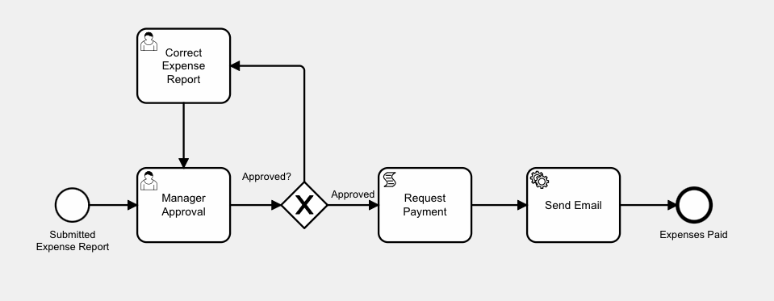

## Pre-Requirements

This workshop requires Oracle APEX v24.2, Flows for APEX v25.1, and Oracle database 19c.

1. Before starting this tutorial, you should have successfully downloaded the latest version of the Flows for APEX packaged app [here](https://github.com/flowsforapex/apex-flowsforapex/releases/latest) and imported it into your APEX workspace.  You can find more information about the installation process [here](/{{ page.collection }}/installation)

2.  To save time, we have created a basic application (**Flows for APEX Starter Workshop**) that you will enable for Flows for APEX.  [Starter File will be linked from here].  You should also download our workshop starter APEX app.  Install it into your APEX workspace, including the supporting objects. This installs:

	- `EXPENSE_REPORT` table
	
	  - `PAYMENT_REQUEST` table
	
	  - `Flows for APEX Starter Workshop` APEX application, already containing a report and form on `EXPENSE_REPORTS`
	
	  - `Approve Expenses` APEX Human Task definition (we will enhance this)
	
## First steps with the engine app

### Create the business process model

- **Log in** to the Flows for APEX application, **open the menu** by clicking the *hamburger* menu at the top left, and go to "**Flow Management**".   The Flow Management page shows you all of the process definitions or process diagrams that are on the system.  When you first install Flows for APEX, this should contain over 25 BPMN tutorial diagrams that you can work through later.

- Click on the **Create Model** button the top right.
- Complete the form with the following information
  - **Category**: "My Training Models"
  - **Name**:       "Expense Report"
  - **Version**:    "0"

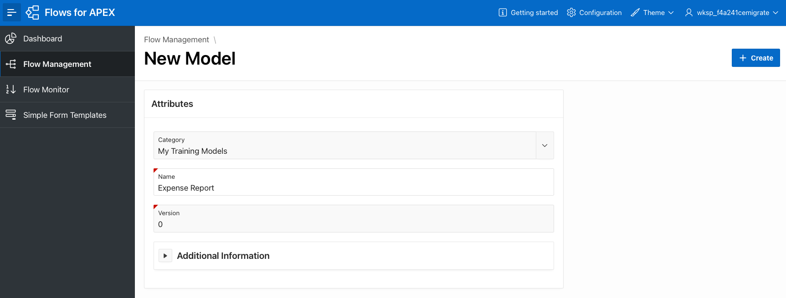

- Click the **Create** button.

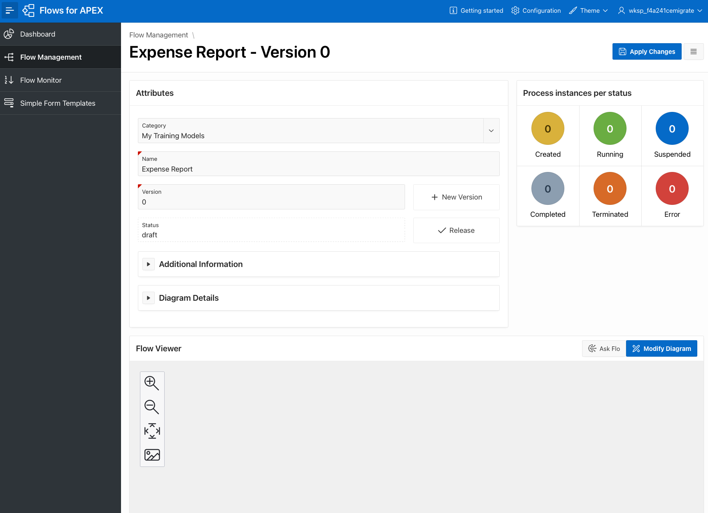

### Edit your first BPMN diagram

- Click on the **Modify Diagram** button in the Flow Viewer region header to open the **Flow Modeler**.  
- The **Flow Modeler** screen will open.  This is a graphical BPMN process modeling tool.  Note the **toolbar** on the left hand side, and the **properties panel** on the right side.
  On the toolbar, click on the Start Event icon ( <span class="bpmn-icon bpmn-icon-start-event-none"></span> ), the thin single circle , **drag** it into the blank canvas area then **double click** on the event and type "Submitted Expense Report" in the text area to name our new Start event.  This documents our process **starting condition**.

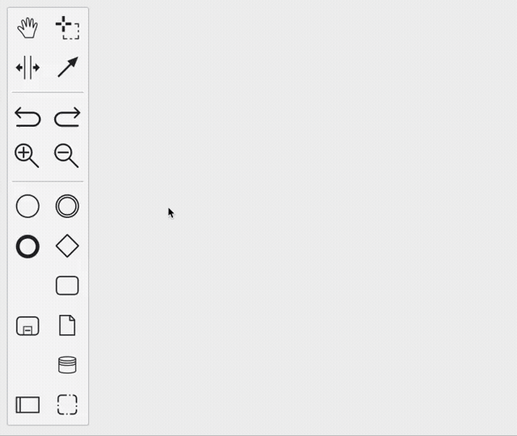{: .align-center}

- **Select** the start event and you will see a **tool menu** open next to it.  Click on the task symbol ( <span class="bpmn-icon bpmn-icon-task-none"></span> ), labeled **Append task**.  Select your new task  and name it "**Manager Approval**".

- 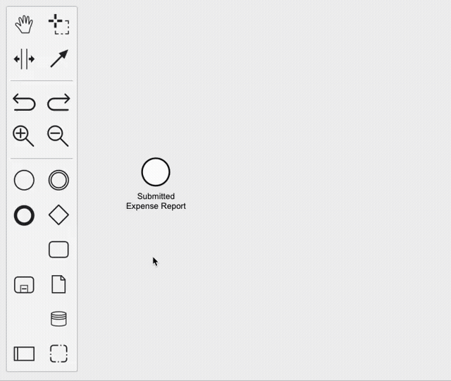{: .align-center}

- Select the Task, click on the Gateway symbol ( <span class="bpmn-icon bpmn-icon-gateway-none"></span>), labeled **Append gateway**, then double click on the gateway, name it "Approved?" and drag the name to be above and left of the gateway
  
  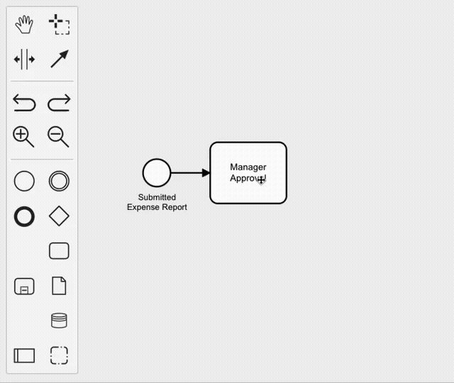{: .align-center}
  
- Select the Gateway, click on the Task symbol ( <span class="bpmn-icon bpmn-icon-task-none"></span> ), labeled **Append task**.  Name that **Request Payment**.  Then select te gateway again, and append another task.  Drag this To above Manager Approval, and rename it **Correct Expense Report**.

  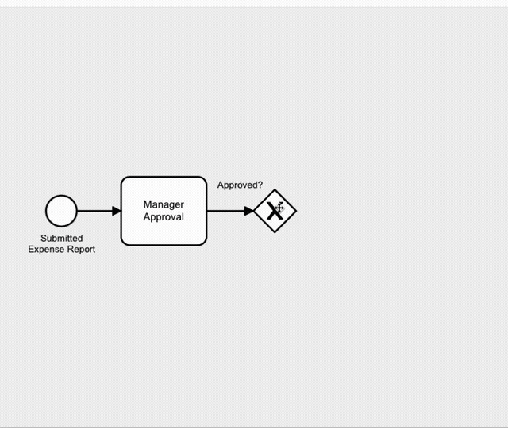{: .align-center}

- Select the link between the gateway and the Request Payment task.  This is a **BPMN Sequence Flow**.  Name this **approved**.  Repeat this with the other sEquence Flow from the gateway, naming it **rejected**. 

   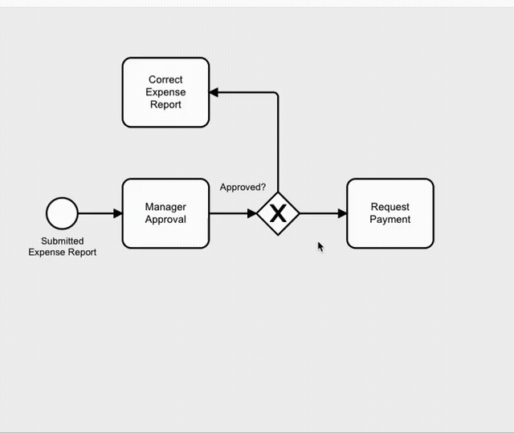{: .align-center}

- Now add another task after Request Payment, and rename it **Send Email**.  Then append an **End Event** ( <span class="bpmn-icon bpmn-icon-end-event-none"></span>). 

   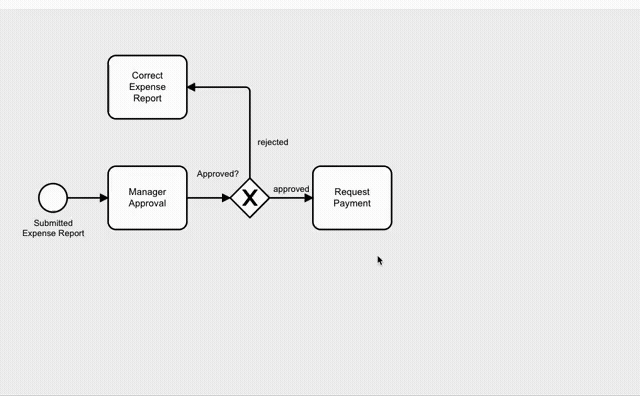

- We need to add one more Sequence Flow, to close the feedback loop from **Correct Expense Report** and resubmit it to **Manager Approval**.  Click on Correct Expense Report to select it, select the arrow tool (**Connect to another element**).

  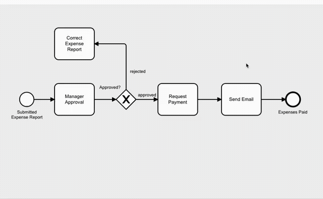{: .align-center}

- We've finished laying out a high level model for our **Expense Report** process.  Click on **Apply Changes** to save the model into Flows for APEX.  

This saves the model as a BPMN diagram, an XML document, and also parsed into the objects and connections in the model that will be stored in relational tables that are used to execute the model.

We can now go to the **Flow Monitor** and test our process flow.

### Test Run the Model in the Flow Monitor

When you model and workflow is complete, your users will interact with it through your application.  But we can test run it now by creating an instance of the workflow in the **Flow Monitor** and step it forward there.  Note that our process is not fully defined yet, and no application exists yet -- but we can still test run it.  This is a useful exercise that process designers / business analysts / consultants can do with the business process owners to confirm the business process. 

- Open the **Flow Monitor** 
- Using the **+ Create Instance** button at the top right, **Create a Flow Instance** of our **Expense Report** model. 
  - Model: search for and select our **Expense Report** model
  - Name: **My First Test Expense Report Run**
  - Business Reference:  You can leave blank now, but this is used to create a process variable named **BUSINESS_REF** that would contain the primary key of the subject table for this process.  For our expense report process, this will eventually contain the **expense_id** of the expense report we are approving and paying.
  - Logging Level: You can leave blank now, but in future this gives you the ability to set a higher loggig level for a manually started process run - useful for debugging.
- Click **Create** to create the process instance.

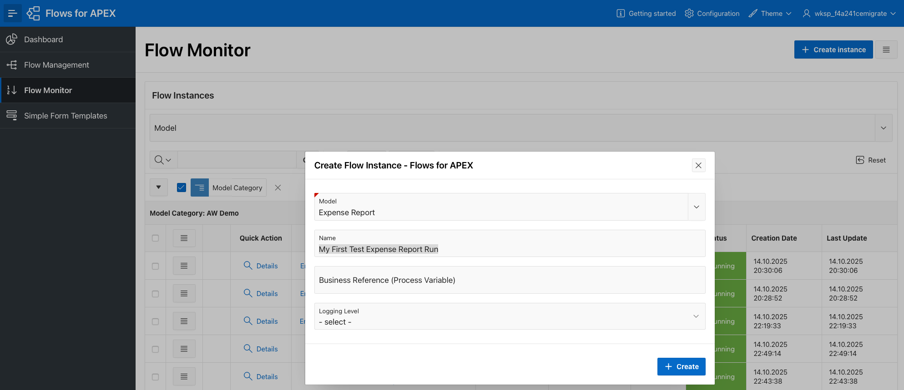

We now have a **process instance** of our Expense Report process that has been **created** but not yet **started**.  

- Find your new instance by searching by the model (**Expense Report**)

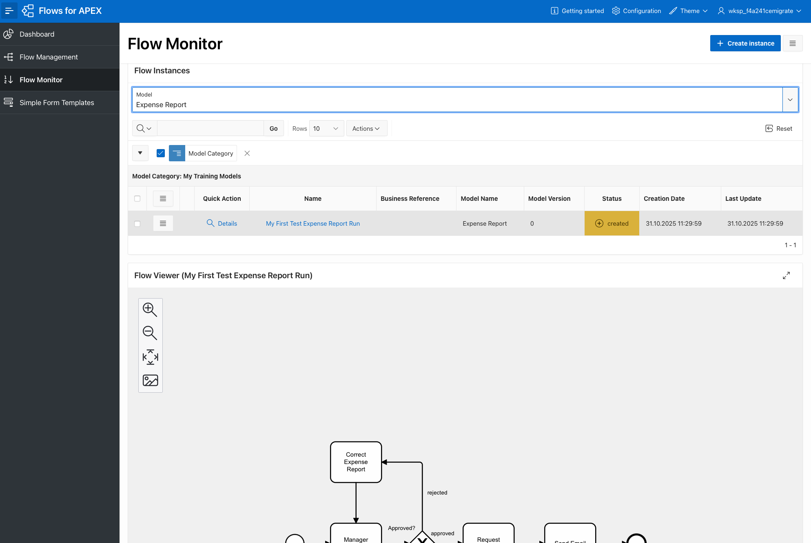

- Click on **Details** to open the Instance Details page for our process instance.

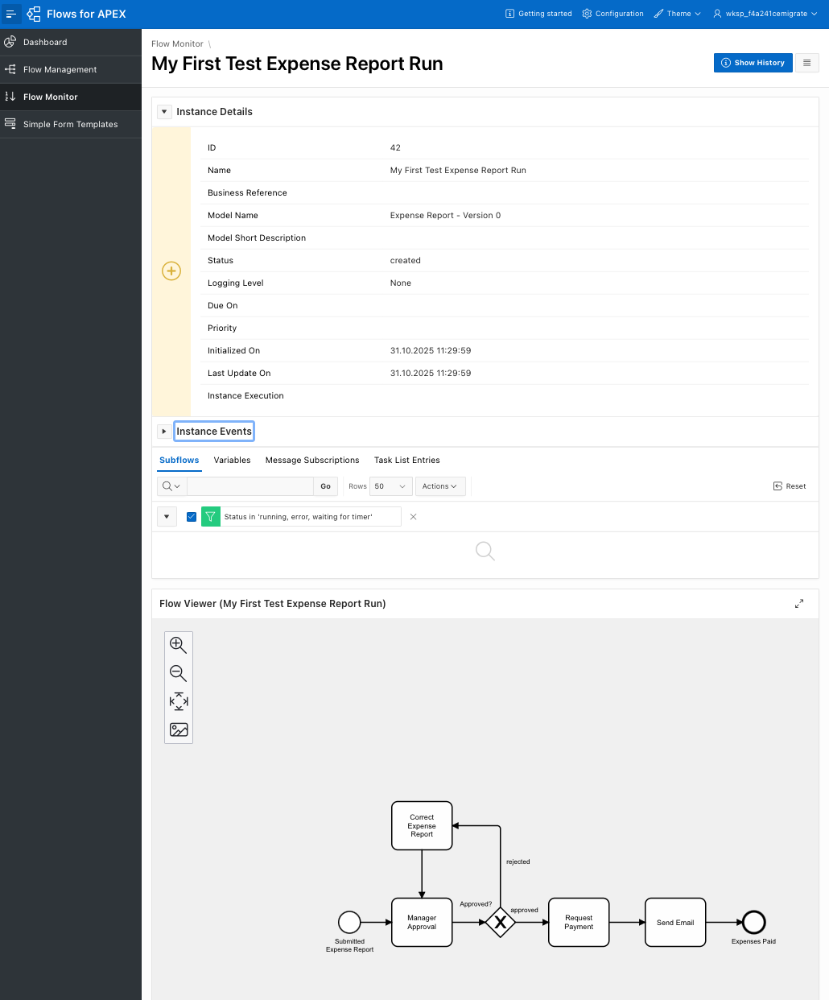

- Start the process instance.  Using the hamburger menu in the top right, select **Start**.

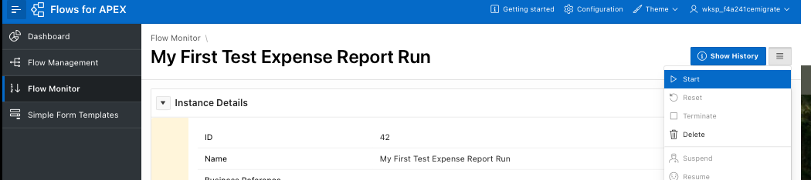

- You can see that now the workflow instance has **started**, it now has one **subflow** that is **running**, and the **current step** on the workflow is our **Manager Approval** task.

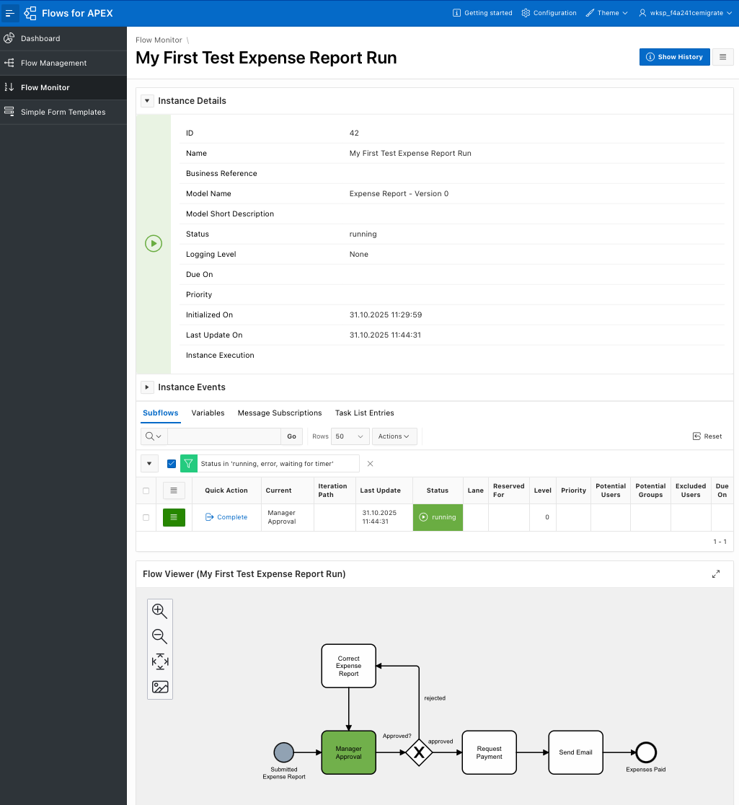

- Click **Complete** to step the workflow forward... we get an **error** cause our (not yet complete) model hasn't told the gateway which path we want to take...

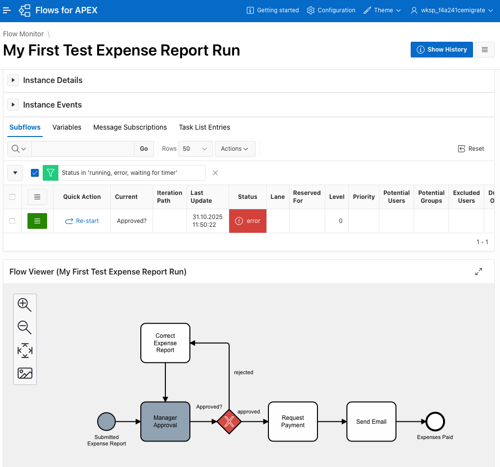

- In the Flow Monitor, we can **set gateway routing** and then **restart an errored process step**.  Open the **Variables** tab, select **Set Gateway Routing**, and set it to go on the **approved** path.  Then select the **Subflows** tab, and **re-start** the subflow.

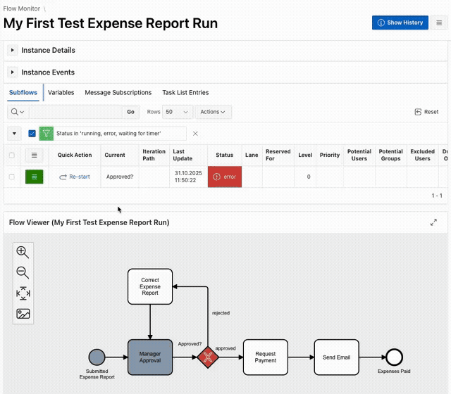

- You can step the process forward until it completes.  If you want to experiment further, you can **reset** the instance from the instance action menu (top right), which returns it to it's **created** status, deleting all process variables except business_ref.  Test routing via the **rejected** route.

You can now see how to test run a process instance - even though we have very little detail added to the process and we don't have an application for it.  This is a useful exercise that process designers / business analysts / consultants can do with the business process owners to confirm the business process. 

### Prepare our Application for Flows for APEX - Add Components 

Your application needs some plugins so that you can start process instances, step them forward, set process variables, and use APEX Human Tasks without having to add PL/SQL code into the app.  Using **APEX Component Groups**, new in APEX v24.1, it's now very easy to add everything you need into your app in one simple action.

- In the APEX Application Builder, open the **Flows for APEX Starter Workshop** app that you downloaded and installed earlier.
- Go to **Shared Components** >> **Component Groups**.  Select  **Copy from another app** in the Tasks section in the right hand panel.
- Copy the **Flows for APEX Components** from the **Flows for APEX** app.

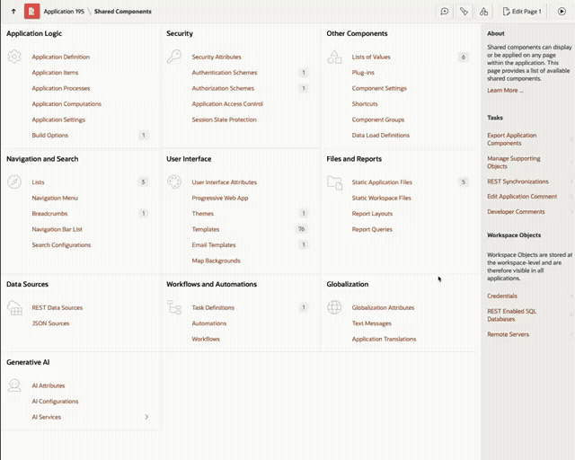

You now have all of the plugins that you need.  We've also created three **application items** that will be used to hold the **process_ID**, **subflow_ID**, and **step_key** when a step starts.  These three parmeters always need to be returned when a step completes.

### Prepare your Application - Create and Configure an APEX Task List.

As part of the APEX Workflow and APEX Human Task functionality, APEX can generate a page containing all of the required functionality for a unified Task List, containing all of the current tasks that a user is the actual or potential owner of.  To use this for Flows for APEX tasks as well as APEX Tasks, we need to do a little configuration so that the Flows for APEX tasks are shown and have appropriate buttons.

For this workshop, we have done this for you - the Task List page in the **Flows for APEX Starter Workshop** app already contains a configured tasTask List page.  But so you know how to set this up on your next application project, all you needto do is follow the instructions in our documentation [how-to page on the APEX Task List](/{{page.collection}}/apex-task-list/).

That was easy!

### Starting a Process Instance from your App

If yu take a look at the starter app, **Flows for APEX Starter Workshop**, you can see that there is a page 2 containing an APEX interactive report on **Expense Reports**.  The report has a **Create** button, which opens page 3, a form named **Expense Report** that allows you to create an expense report.  These are just default report and form pages generated by APEX.

We want to modify the form so that when it creates an expense report, it also **creates** our expense report workflow.  If you look at the process diagram, you'll see that the starting condition, used to name the Start Event, is *Submitted Expense Report*.  So our process needs to **start** when the expense report is **submitted**.  (To avoid your later confusion, note that the process **does not** include **creating the expense report**.  Our *Create Expense Report* form starts the process but is not a task in the workflow.  This disctinction may seem pedantic, but being clear what is the starting event, and what is in or out of the workflow, will avoid pain ater!)

So as part of saving the expense report, we need to create and start an instance of the Expense Report process.

- In the APEX Application Builder, **open** page 3, **Expense Report**.
- In the left panel, select the **Processing** tab.  This currently contains 2 processes, *Process form Expense Report* and *Close Dialog*.
- Right Click on **Processing** >> **Processes** to get the action menu. Select **Create Process** to create a new process, and then drag the New process so that it is **after** the *Process form Expense Report* process.  We always want the Flows for APEX process to occur after the database DML process. 
- With our **new** process, configure as follows.
  - Name: **Start a Flows for APEX Process Instance**
  - Type: **Flows for APEX - Manage Flow Instance**
  - Settings:  Action:  **Create and Start**
  - Flow Instance Name:  This is the name of the **instance**, not the diagram name.  **Expense Approval &P3_ID.**
  - Select Flow (diagram) using: **Static Text**
  - Static Text: **Expense Report**
  - Flow (Diagram) selection based on: **name**  
  - Set Business Reference: **P3_ID**
  - We don't need to return the Instance ID or set process variables here.
- **Save** the page.

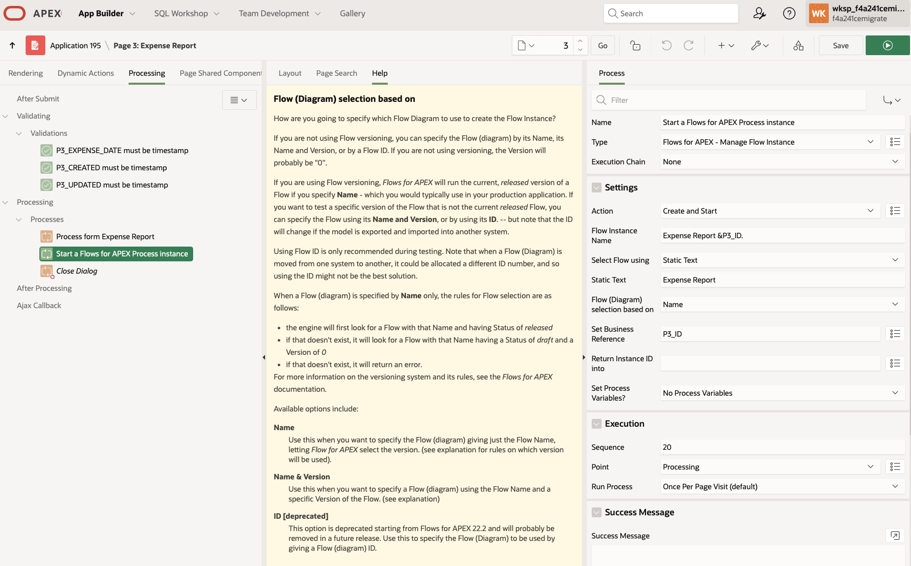

This will now start a workflow process when a new expense report is saved.

### Further Refine our Model - Configure the Approval and Gateway Routing.

We're going to get the **Manager Approval** and **approved?** gateway working first. This is going to implemented in our application using an APEX Human Task (APEX Approval Task).

Go back to the Flows for APEX app, select the **Flow Management** tab, and find our **Expense Report** process.  Click on the process name to open the model details page.  Click on **Modify Diagram** to re-open the diagram in the **Flow Modeler**.

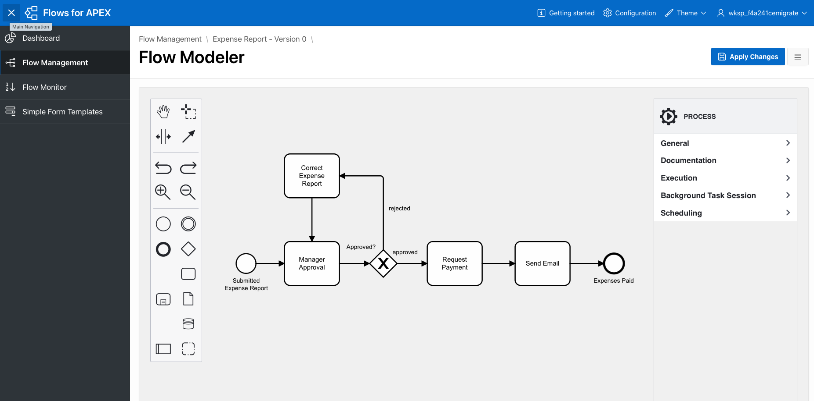

- Select the **Manager Approval** task.  Using the spanner / wrench tool ( <span class="bpmn-icon bpmn-icon-screw-wrench"></span> ), convert out generic task to a **User task**.

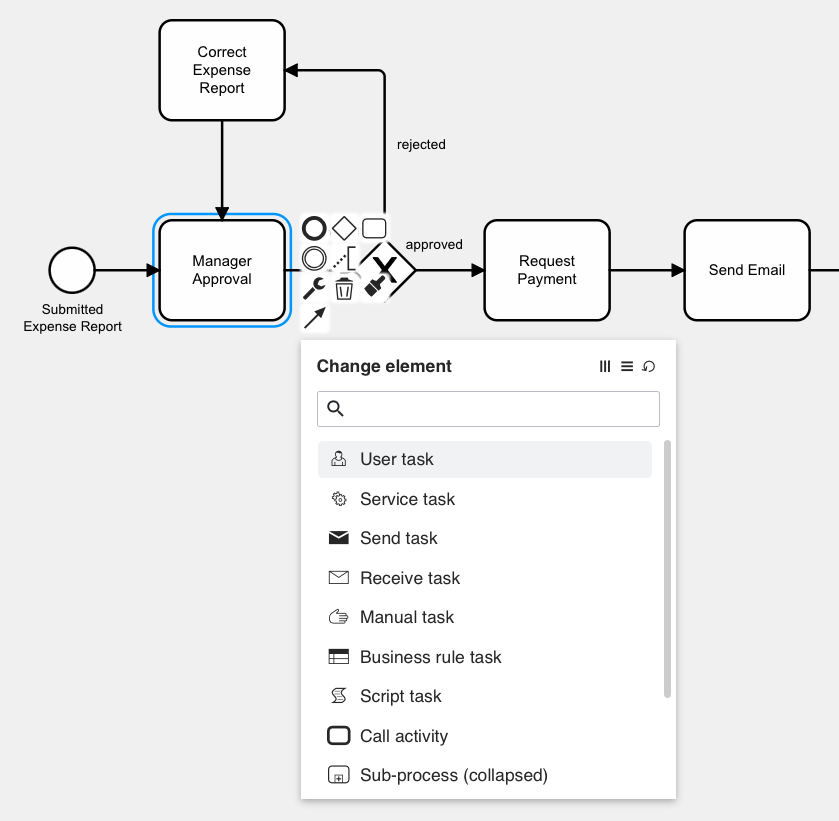{: .align-center}

Notice that the Properties Panel for the task now has many more configuration options.  

- In the **Properties Panel**, open up the **Task Type** region, and select **APEX Human Task**.
- Open the **APEX Human Task** region:
  - Turn on **Use APEX Meta Data**.
  - Application:  Select the **Flows for APEX Starter Workshop**.
  - Task Definition:  Select **Approve Expense**
  - Subject:  leave blank - we don't want to over-ride the subject already defined in the task definition.
  - Business Reference:  Click on the blue link named **business ref** undeneath the item.  This will load the value `&F4A$BUSINESS_REF.` into the item.  (Note:  Flows for APEX process variables can be substituted using APEX `&name.` syntax -- but we always prefix the variable name with (upper case) `F4A$` to prevent APEX item names and Flows for APEX variable names getting confused.)
  - Parameters.  The APEX Human Task requires some tas paraeters to be set.  If you click on the green **Load Parameters** link, we will pre-populate a paraeter for each expected parametr.   And we'll set the value for `process_id`, `subflow_id`, and `step_key` for you as well.
  - Outcome Variable.  The Flows for APEX process variable name to return the Approval Outcome into.  We'll set that to `APPROVAL_OUTCOME`
  - Initiator - leave blank
  - Initiator Can Complete.  In this workshop, we'll do everything as one user - so turn this **on**.

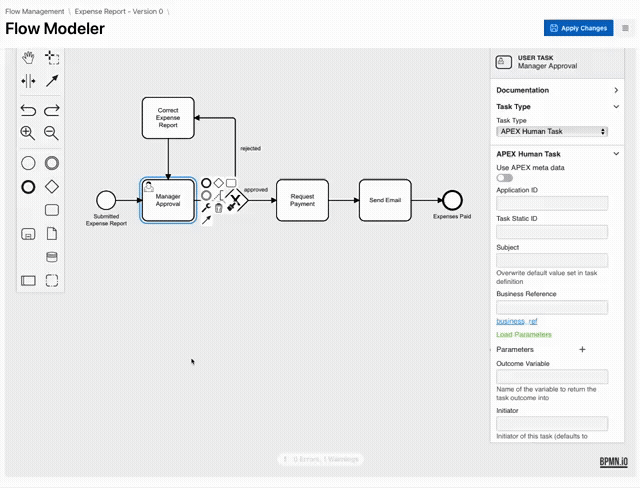{: .align-center}

- Now we're going to configure the Gateway routing to use the Outcome from our Approval Task.  Select not the gateway but the link between the **Approved?** gateway and the **Request Payment Task** - the **approved sequence flow**.  In the properties panel, open the **condition** region, then:
  - Sequence: **10**
  - Condition Type: **Expression** (for a PL/SQL condition)
  - Condition: `:F4A$approval_outcome = 'APPROVED'`

- Select the **rejected sequence flow**, and apply the opposite expression.
  - Sequence: 20
  - Condition Type: **Expression**
  - Condition  `:F4A$approval_outcome = 'REJECTED'`

- **Apply Changes** to save our updated process diagram.

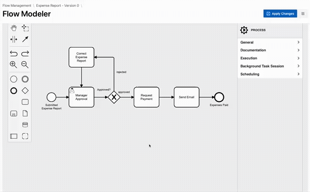{: .align-center}

We should now be able to test the first bit of our workflow.  We should be able to start a process instance, create an approval task for the manager, and move the workflow forwards on the **approved** path.  Let's give it a try...

#### Test  our workflow start

From the APEX Application builder, **Run** the **Flows for APEX Starter Workshop**  app.

- Click on the **Expense Reports** menu item to open the **Expense Reports** interactive report. (P2).

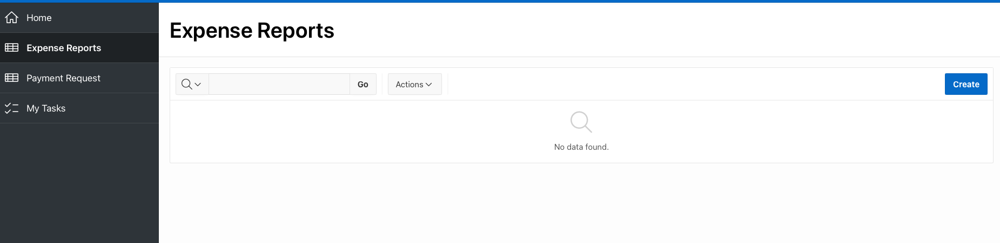

- Click on the **Create** button 

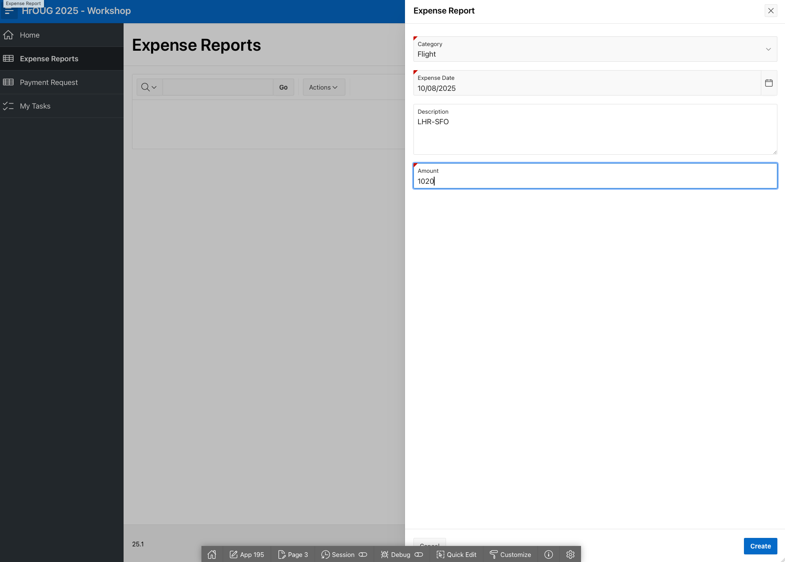

- Create the expense report.  Our exense report was created.

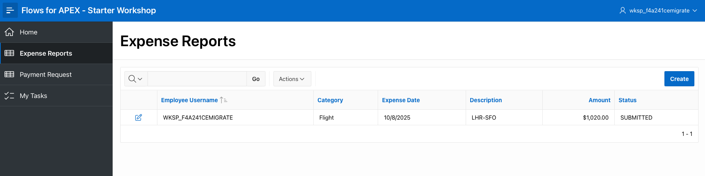

- In the left menu, select **My Tasks**.  You can see the Approval Task in the APEX Task List.

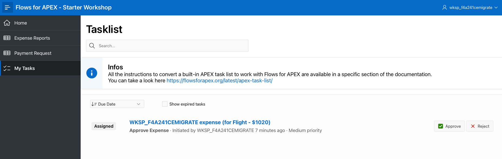

- Click on **approve** to approve the expense report.

- Let's now look at the **Flow Monitor**.  We are expecting the workflow will now have used the approval outcome to set a Flows for APEX process variable, **approval_outcome** to **APPROVED**, and for the gateway to have used this to move the process forward to the **Request Payment** step.

  After finding our process instance and opening it, we can se that the process is **running** -- but it's still on the **Manager Approval** step.  

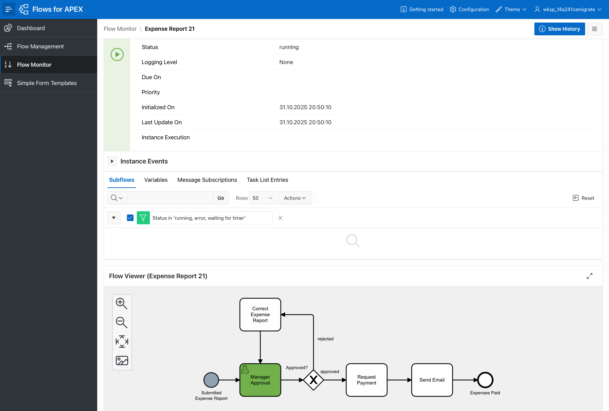

​	That's **not** what we were expecting.  Let's look at the process variables in the **Variables** tab.  You can see that the `BUSINESS_REF` is set, but our `APPROVAL_OUTCOME` doesn't exist.  We didn't do anything in our APEX Human Task to return the outcome to Flows for APEX.  Let's go and fix that...

- Open our **Flows for APEX - Starter Workshop** app in the APEX app builder.  Go to **Shared Components** and then T**Task Definitions**.  Open the **Approve Expenses** approval task.
  Inspect the task definition.  Note that:
  - We set a task subjectusing some substitution parameters.  All good.
  - The Actions Table Primary Key is the **EXPENSE_REPORT.ID** .  That's consistent with our **business_ref** in Flows for APEX.  All good.
  - The Potential Owner is set to the APP_USER.  That's unusual in a real application, but OK for this workshop.  (see [APEX Human Task doc](/{{page.collection}}/apex-human-task/) for how to configure this when you build a real app!).
  - Task Parameters are set to process_id, subflow_id, and step_key -- as they should be.   All good.
  - Actions.  There aren't any **task actions** defined!  So our approval task doesn't yet do anything when it completes.  Here's our problem.  We need to add a **task action** for **task completion**, and we should also add actions for **cancellation**, **expiry** (if our Human Task has expiration rules - which it doesn't).
- Click on **Add Action**
  - Name: **Return Outcome to Flows for APEX on completion**
  - Type: **Flows for APEX - Return APEX Human Task State and Outcome [Plug-in]**
  - On Event: **Complete**
  - Outcome:  Don't select either option.  But if you do, you will need to create another task action for the other outcome.
  - Note the Action Settings have automatically appeared, naming the **task parameters** containing **process_id**, **subflow_id**, and **step_key**.  All good,
  - Click **Create**
- Click on **Add Action**
  - Name: **Return state to Flows for APEX on cancel**
  - Type: **Flows for APEX - Return APEX Human Task State and Outcome [Plug-in]**
  - On Event: **Cancel**
  - Note the Action Settings have automatically appeared, naming the **task parameters** containing **process_id**, **subflow_id**, and **step_key**.  All good,
- Click **Apply Changes**

Our Approval Task should now work if we try creating another expense report.

- Go back to our **Flows for APEX - Starter Workshop** run time app.  Select **Expense Reports**, and **Create** another expense report.

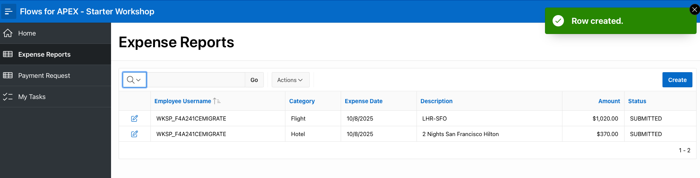

- Go to **My Tasks** and **approve ** our new claim.  Now when we look at this in the **Flow Monitor**, we see that our new process is on the **Request Payment** step.  Our **Start Event**, **approval task**, and our **gateway** all work.

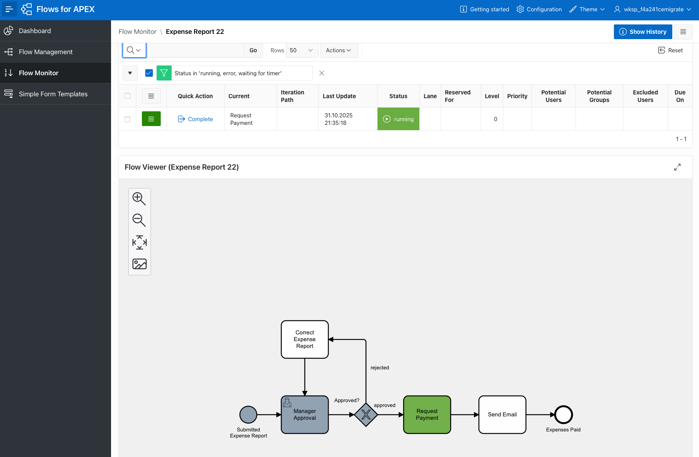


### Continue Building our Model - Script Tasks and Service Tasks

Let's go back to the **Flow Manager** in the **Flows for APEX app**, and complete what happens to an **approved** expense report.  

#### Request Payment - PL/SQL Script Task.

In our scenario, once approved, we will have a PL/SQL script that is run automatically to **request payment** in our payment system.  The PL/SQL script will be run by the Flows for APEX workflow engine.

In **Flow Management**, find our **Exense Report** diagram, and open it in the **Flow Modeler** again.

- Select the **Request Payment** task.  Use the spanner / wrench tool, change this to a **Script Task**.

- Set the **Task Type** to **Execute PL/SQL**.

- Then open the **PL/SQL region**, and using the **open editor icon**, open the code editor.  Paste in the following PL/SQL code:

  ```plsql
  declare
      l_process_id        number := flow_globals.process_id;
      l_expense_id        expense_report.id%type;
      l_employee_username expense_report.employee_username%type;
      l_category          expense_report.category%type;
      l_amount            expense_report.amount%type;
  begin
      -- get business reference from workflow instance
      l_expense_id := flow_process_vars.get_business_ref(pi_prcs_id => l_process_id);
  
      --update expense status
      update expense_report
         set status = 'APPROVED'
       where id =  l_expense_id
       returning employee_username, category, amount
       into l_employee_username, l_category, l_amount;
  
       -- insert a payment request 
      insert into payment_request
      (employee_username, category, amount)
      values 
      (l_employee_username, l_category, l_amount);
  end;
  ```

  Notice how we are able to get process state (like the  `process_id` and the `business_ref` of the current process instance inside our script.  We can also access any process variables for our current process instance using both **substitution** syntax (&F4A$MyVariable.) and **bind** syntax (:F4A$MyVariable) from inside our script.

  This script is going to get the expense report ID for the instance from the `BUSINESS_REF` variable, and then update the expense report to set it's status to 'APPROVED' and insert a payment request into the `PAYMENT_REQUESTS` table. 

- **Validate** the PL/SQL code with the Code Validator (Tick Mark button), and click **Save**.

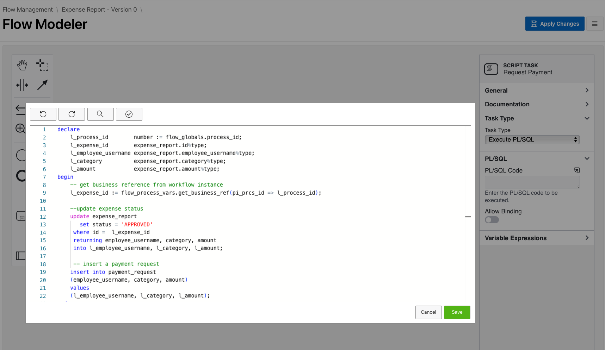

- The **Binding** options below the code editor are **important**.  
  If your script code contains references to Flows for APEX process variables, select **Allow Binding** and then cloose **Bind Process Variables**.

  There is an option to bind APEX page items, which is deprecated, and generally **shouldn't be used** -- as the page items might not be there when the script is executed, especially if the script has to be restarted after a step failure.  Instead, you should make sure that any variables that you need to pass from one process step to another are passed through **process variables**, which are available for the duration of the process instance.  A Flows for APEX process will typically span multiple APEX sessions, and so using APEX page items to store values between process steps is not a good idea.

- Click **Apply Changes** to save your model.

We've now configured a PL/SQL Script Task.  This will be run automatically when the task becomes the current step.  When finished, the process will move on to the next step.

#### Configure a Service Task - Send Email

Our next step in the process sends an **email** to the employee, notifying them that their expenses are approved and will be paid.

As we are built on top of Oracle APEX, we use the APEX Send Mail functionality - which allows us to easily create **email templates** and create substitutable emails.  We have created an email template for you in advance in the starter APEX application to save time.

- In the **Flow Modeler**, select the **send Email** task.  Using the spanner / wrench tool, change the standard task to a **Service Task**.
- Flows for APEX supports several Sevice Task Types.  Select **Send Mail**.
- Open the **Mail** region, and configure as below:
  - Send Email Immediately: For testing and maybe deployment, set **on**
  - From:  your sending email address (e.g., me@example.com).  Note:  If you are using OCI mail services, the *from* address needs to be an authorized sender in your OCI mail service configuration.
  - Use Template:  **on**
  - Use APEX meta data: **on**
  - Application: select the **Flows for APEX Starter Workshop** app.
  - Template: select the **Expense Approved** template.
  - Placeholder:  Click the **Load JSON** green button & then open the code editor.  You will see a JSON document template listing the plavehoders required for the selected email template.
    - Edit this so that **amount**, **category**, and **expense_date** are linked to Flows for APEX process variables named **amount**, **category**, and **expense_date**.  (these don't exist yet - we'll set them up next).
    - **Validate** and then **Save** the placeholders json.

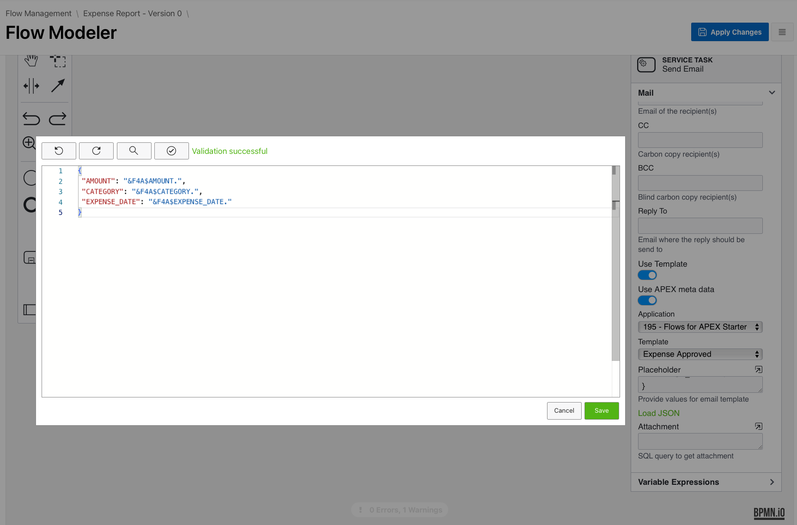

- Now we need to create **Flows for APEX Process Variables** to hold these values which are in the expenses table in our **system of record**, but don't exist yet as *process variables*.
  Flows for APEX includes a **variable expression** feature which is, essentially a trigger which fires **before** and **after ** each process step to **set process variables** based on a static definition, as a copy of another process variable, or as the result of a **SQL query**, a **PL/SQL expression**, or a **PL/SQL function body**.  Having this ability to set variables from database queries or expressions as we move through the process instance gives Flows for APEX massive power and flexibility, as these variables can be used as input data for a step and also to control many settings controlling how the step gets executed.

- We will use variable expressions on the **Send Email** task that execute **before task** to set the email addressee, the category, amount, and expense date (as a string) from our system of record for use in our email template.

  - Open the **Variable Expressions** region on our **Send Email** task.
  - Sequence:1
  - Name: EMAIL
  - Data Type: Varchar2
  - Expression Type: SQL Query (single value)
  - Expression:

  ```
  select employee_username
    from expense_report
   where id = :F4A$BUSINESS_REF
  ```

  - Add another Variable Expression for **amount** as a **varchar2** as a **SQL Query** with expression:

  ```
  select amount
    from expense_report
   where id = :F4A$BUSINESS_REF
  ```

  - Add another Variable Expression for **expense_date** as a **varchar2** as a **SQL Query** with expression:

  ```
  select to_char(expense_date, 'DD/MM/YYYY')
    from expense_report
   where id = :F4A$BUSINESS_REF
  ```

  - Add another Variable Expression for **category** as a **varchar2** as a **SQL Query** with expression:

  ```
  select category
    from expense_report
   where id = :F4A$BUSINESS_REF
  ```

- Click **Apply Changes**.

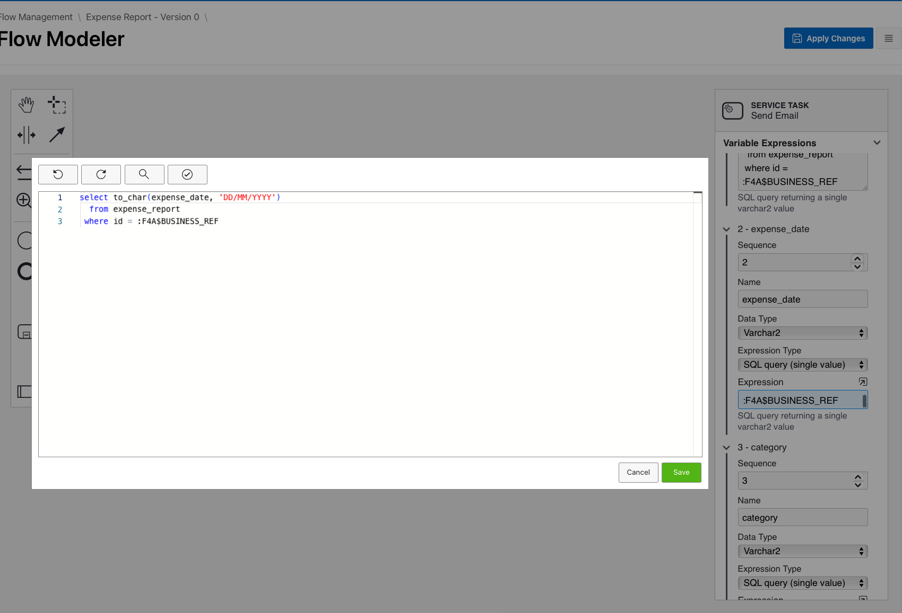This should conclude our Email configuration.  You've also learnt about **variable expressions**.

We can test our **approved** route through the model now.

#### Test the Approved route

All of the steps should now work if the path is 'APPROVED.

'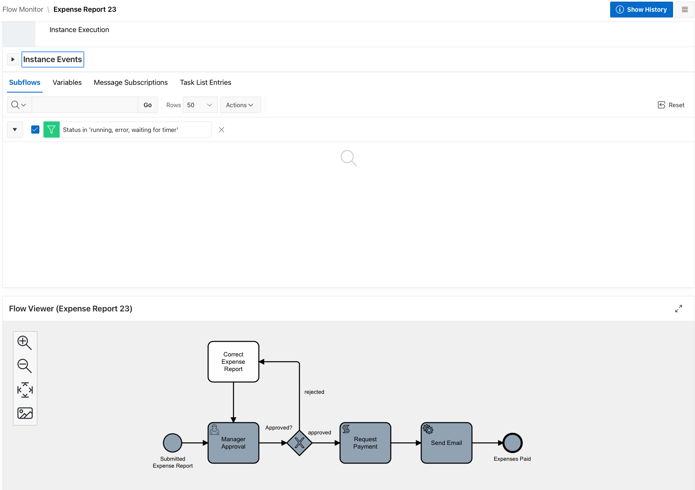

### Complete the Rejected route

If our expense report gets rejected by the **Manager Approval** step, we want to route it back to the **originator** for them to rework the expense report and resubmit it,  For this we want to use an APEX page containing a form on the expense report.

Note we could have used our existing page 3 form - but to keep the page processes simple in this workshop, we have used a separate form page, which has been created in your starter app as page 5, **Correct Expense Report**.  We're going to link tis in as a **BPMN User Task**  -- but this time of type **APEX Page Task**.

- Open the **Flows for APEX** app, find our process diagram, and open it in the **Flow Modeler**.
- Click on the **Correct Expense Report** task to select it.  Using the task menu, again select the spanner / wrench tool, and change the task type to be a **BPMN User task**.
- In the properties panel, open **Task Type**, and set it to **APEX Page**.
- Open the **APEX Page** region, and configure as follows:
  - Use APEX Meta Data: **on**
  - Application: Select the **Flows for APEX tarter Workshop**
  - Page: Select **page 5 - Correct Expense Report**
  - Click on the green **Generate Page Items** link.  This generates links to three page items (actually in our case, APEX Application Items) **process_id**, **subflow_id**, and **step_key**.
  - Add an additional **page Item** manually:
    - Item: **P5_ID**
    - Item Value: **&F4A$BUSINESS_REF.**
  - Clear Cache for page 5.
- **Task Assignment**: Potential Owner: Use a PL/SQL function body to `return v('APP_USER');` to assign the task to ourselves.


- **Apply Changes** to save our model.

Now we need do a small change to our Application so that the page steps the workflow forward when the changes are saved.

- Open our **Flows for APEX Starter Workshop** app in the APEX Application Builder, and open **page 5: Correct Expense Report**.
- Select the **Processing** tab on the left panel, right-click on **Processes**, and add a new process below the existing **Process form Correct Expense Report** process.  (We **always** put the **Complete Flows for APEX step** process **AFTER** the page DML progresses as the workflow engine will **commit** the work done in the step and the workflow step in a single transaction when the workflow step completes).  Configure it as follows:
  - Name: **Complete Flows for APEX step**
  - Type:  **Flows for APEX - Manage Flow Instance Step**
  - Action: **Complete Step**
  - Flow Instance info: **In Page items**
  - Process ID Item: **PROCESS_ID** (application item)
  - Subflow ID Item: **SUBFLOW_ID** (application item)
  - Step Key Item: **STEP_KEY** (application item)
  - Don't set Gateway Routing, Auto Branching, or return the Instance and Subflow ID.
  - Server Side Condition: **When Button Pressed - SAVE**
- **After Processing** add a branch to return to the task list, page 6, when the SAVE button was pushed

We should now have a finished & working application and workflow.  Congratulations!

If you want to download a completed application, download from here.  Note that the completed application uses a BPMN diagram named **Expense Report Solution**, rather than **Expense Report** so that it doesn't conflict with the starter app.  When you install the completed application and then install the Supporting Objects, you will get some errors when supporting objects are installed if you have already installed the starter app.  This will be the 2 underlying tables - just ignore this error.  The supporting object install will install the completed process diagram for you, however.

## Summary


{to be finalised}


